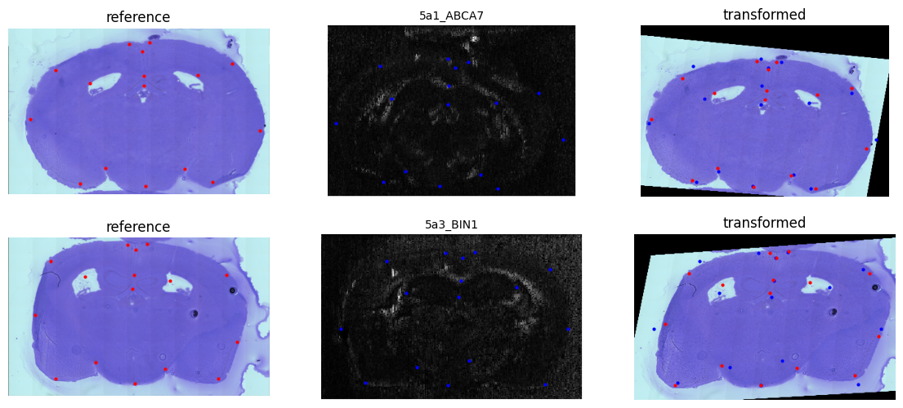

# McIntire Lab - Spatial Omics Image Registration Pipeline

## Overview
This repository contains scripts and documentation for a semi-automatic pipeline to register and integrate spatial omics data from mouse brain cross-sections. The workflow integrates spatial transcriptomics (*Visium*) and spatial metabolomics (*DESI*), using the *Allen Mouse Brain Atlas* as a spatial reference.

---

## Workflow Steps

### 0. Manual Image Registration
Manually register the representative H&E image using:

- `Filebuilder.bat` (QuickNII utility)
- `QuickNII`
- `VisuAlign`

### 1. Visium Data Preprocessing & Registration
Scripts:
- `scripts/01_VISIUM_preprocess.R`
- `scripts/02_VISIUM_generate_landmarks.R`
- `scripts/03_VISIUM_image_registration.ipynb`
- `scripts/04_VISIUM_annotate_seurat.R`

### 2. DESI Data Preprocessing & Registration
Scripts:
- `scripts/05_DESI_ion_matrix.ipynb`
- `scripts/06_DESI_preprocess.R`
- `scripts/07_DESI_generate_landmarks.R`
- `scripts/08_DESI_image_registration.ipynb`

### 3. Spot-to-Region Label Mapping
- `Spots2Labels.ipynb`
- (optional compact version: `spatial registration/Spots2Labels_compact_workflow_do_not_run.ipynb`)

---

## Spatial Registration Pipeline

### 1. Image Preprocessing
- Select a representative H&E image (preferably from Visium).
- Resize it to ~16 MP resolution for compatibility with *QuickNII*.
- Use `Filebuilder.bat` to prepare input.
- Align Allen Mouse Brain Atlas slice to the H&E image in *QuickNII*.
- Export `.xml`, load into *VisuAlign*, and perform non-linear warping.
- Export atlas-based region maps.

### 2. Visium Data Preprocessing
- Import Visium data using *Seurat* (`01_VISIUM_preprocess.R`).
- If applicable, split slides into two regions.
- Adjust image size and coordinate system accordingly.

### 3. Landmark Selection
- In R (`02_VISIUM_generate_landmarks.R`), select consistent anatomical landmarks in both H&E and atlas maps.
- Recommend fewer than 24 points, covering borders and hippocampal region.
- Save coordinates to tabular format.

### 4. First Spatial Registration
- Load landmarks and images in Python (`03_VISIUM_image_registration.ipynb`) using `cv2`.
- Align reference image to each brain section using `cv2.findHomography`.
- Overlay and assign pixel-level region annotations.
- Export resulting tables with pixel-region assignments.
- Annotate Seurat object using `04_VISIUM_annotate_seurat.R`.

### 5. DESI Ion Data Preprocessing
- Convert DESI ion data to a tabular matrix (`05_DESI_ion_matrix.ipynb`).
- Select a control ion feature to reconstruct tissue-like image.
- Create pseudo-image using x/y coordinates and intensity values.

### 6. Landmarking on DESI
- Identify and annotate anatomical landmarks in DESI pseudo-images (`07_DESI_generate_landmarks.R`).
- Align DESI coordinate system to that of Visium data.

### 7. Second Spatial Registration
- Use Python (`08_DESI_image_registration.ipynb`) to align DESI images to Visium sections.
- Link Visium spot coordinates to DESI-derived signals.

### 8. Integration & Downstream Analysis
- Merge Visium and DESI data by spatial location.
- Normalize and clean datasets.
- Proceed with multi-omic analysis such as clustering, differential analysis, or pathway enrichment.

---

## Repository Structure

```plaintext
MPI_Registration/
├── data/
│   ├── DESI_files/
│   └── reference/
│       ├── 40x_Wt-317-a4_6mo_(1)_Visium_2A_nl.png
│       └── Color_Scheme_List.csv
│
├── results/
│   ├── plots/
│   ├── py_output/
│   ├── r_output/
│   └── desi_output/
│
├── scripts/
│   ├── 01_VISIUM_preprocess.R
│   ├── 02_VISIUM_generate_landmarks.R
│   ├── 03_VISIUM_image_registration.ipynb
│   ├── 04_VISIUM_annotate_seurat.R
│   ├── 05_DESI_ion_matrix.ipynb
│   ├── 06_DESI_preprocess.R
│   ├── 07_DESI_generate_landmarks.R
│   ├── 08_DESI_image_registration.ipynb
│   └── utils/
│       └── backup_functions.R
│
├── Spots2Labels.ipynb
└── spatial registration/
    ├── Spots2Labels_compact_workflow_do_not_run.ipynb
```
---

## Requirements

### R:
- `Seurat`
- `ggplot2`
- `dplyr`
- `WGCNA`

### Python:
- `numpy`
- `pandas`
- `matplotlib`

### Tools:
- [QuickNII](https://www.nitrc.org/projects/quicknii/)
- [VisuAlign](https://www.nitrc.org/projects/visualign/)
- Allen Mouse Brain Atlas

---

## How to Run
1. Perform manual registration of the H&E image using **QuickNII** + **VisuAlign**.
2. Run Visium preprocessing and registration scripts (`01` to `04`).
3. Process DESI data and generate pseudo-H&E images (`05` to `08`).
4. Perform spatial registration using landmark alignment.
5. Integrate Visium and DESI data and proceed to downstream analysis.

---

## License
MIT License

---

## Contact
For questions or collaborations, please reach out to the **McIntire Lab** or open an issue.
